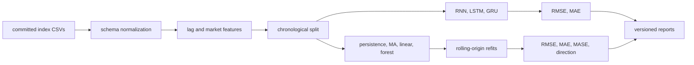

# DL Stock Prediction Case Study

## Problem and solution

Forecasting index levels is an accessible time-series problem but an easy place to overstate results. This project combines recurrent models with a separate rolling-origin baseline study so complex models are compared with persistence, moving-average, linear, and tree forecasts under chronological evaluation.

## Architecture



## Trade-offs

- Price-level forecasting is easy to reproduce but can reward persistence without producing a tradable signal.
- Periodic rolling refits reduce runtime but do not react to every observation.
- A random forest adds nonlinear capacity with existing dependencies, while its lag-only inputs remain intentionally simple.

## Measured validation

The committed [baseline report](../evaluation/baselines-v1/report.md) records 2025 rolling-origin MAE, RMSE, MASE, directional accuracy, improvement relative to persistence, and three-seed random-forest variability for all three indices.

## Limitations and failure modes

- Historical index data does not guarantee future-regime performance.
- No transaction costs, slippage, execution delay, turnover, or risk constraints are modelled.
- Low price-level error is not evidence of profitability.
- The recurrent smoke run validates execution, not convergence or model superiority.

## Reproduce

```bash
python -m venv .venv
source .venv/bin/activate
pip install -e '.[dev]'
ruff check .
pytest -q
python scripts/run_baselines.py
dl-stock-pred --max-epochs 1 --patience 1 --max-trials-per-model 1 --no-plots --output-dir /tmp/dl-stock-smoke
```
